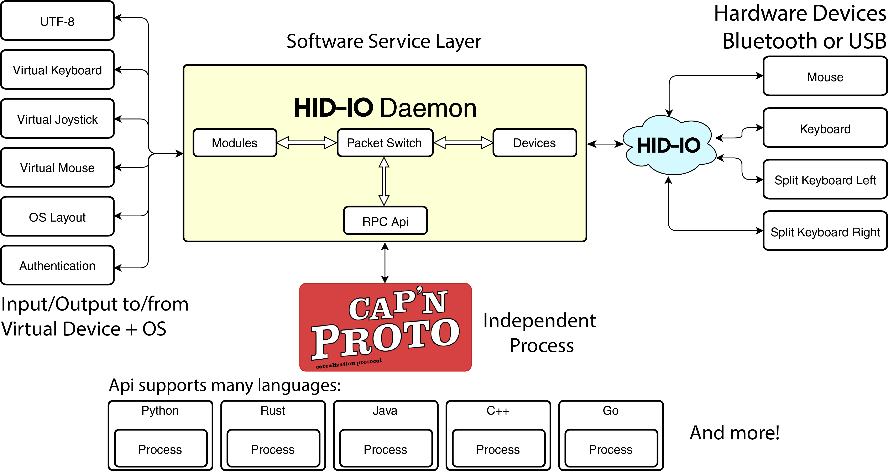

# hid-io core

[](https://github.com/hid-io/hid-io-core/actions)
[](https://github.com/hid-io/hid-io-core/actions)
[](https://github.com/hid-io/hid-io-core/actions)
[](https://github.com/hid-io/hid-io-core/actions)
[](https://lgtm.com/projects/g/hid-io/hid-io-core/alerts/)
[](https://lgtm.com/projects/g/hid-io/hid-io-core/context:python)

[](https://kiwiirc.com/client/irc.freenode.net/#hid-io)

HID-IO Client Side Library and Daemon

### Overview



### API Documentation

* [master](https://hid-io.github.io/hid-io-core/hid_io_core/)

## Getting

Currently you have to build the HID-IO daemon yourself. But it will be made available in binary form once we are ready for a public beta.

## Usage

```bash
hid-io
hid-io --help
```

## RPC Terminal Example

First start hid-io-core in one terminal:

```bash
RUST_BACKTRACE=full RUST_LOG="info,tokio=info,tokio_core::reactor=info" cargo run
```

```
    Finished dev [unoptimized + debuginfo] target(s) in 0.12s
     Running `target/debug/hid-io-core`
INFO [hid_io_core] -------------------------- HID-IO Core starting! --------------------------
INFO [hid_io_core] Log location -> "/tmp"
Press Ctrl-C to exit...
INFO [hid_io_core] Version: 0.1.0-beta3 (git v0.1.0-beta3-9-g29548e1) - debug
INFO [hid_io_core] Build: rustc 1.44.0-nightly (f509b26a7 2020-03-18) (x86_64-unknown-linux-gnu) -> x86_64-unknown-linux-gnu (Sun, 29 Mar 2020 21:40:53 GMT)
INFO [hid_io_core] Initializing HID-IO daemon...
INFO [hid_io_core::module] Initializing modules...
INFO [hid_io_core::device] Initializing devices...
INFO [hid_io_core::device::hidusb] Initializing device/hidusb...
INFO [hid_io_core::device::debug] Initializing device/debug...
INFO [hid_io_core::api] Initializing api...
INFO [hid_io_core::device::hidusb] Spawning hidusb spawning thread...
INFO [hid_io_core::device::debug] Spawning device/debug spawning thread...
INFO [hid_io_core::module] Current layout: us
API: Listening on [::1]:7185
INFO [hid_io_core::device::hidusb] Connecting to id:1 Device: "/dev/hidraw12"
    [308f:0013-ff1c:1100] I:4 Input Club Keyboard - Kira PixelMap USB (5337310036384B323430313035353031 - sam4s8) R:1222
Connected to id:1 USB [308f:0013-ff1c:1100] [Input Club] Keyboard - Kira PixelMap USB 5337310036384B323430313035353031 - sam4s8
INFO [hid_io_core::device] Registering device: 1
INFO [hid_io_core::api] Node list update detected, pushing list to subscribers -> 0
```

Then in another terminal window, start the RPC example program. This will connect you to the device serial port.
Once it's connected, you may begin typing commands.

```bash
cargo run --example rpc
```

```
    Finished dev [unoptimized + debuginfo] target(s) in 0.12s
     Running `target/debug/examples/rpc`
Connecting to [::1]:7185
Version:    0.1.0-beta3 (git v0.1.0-beta3-9-g29548e1)
Buildtime:  Sun, 29 Mar 2020 21:40:53 GMT
Serverarch: x86_64-unknown-linux-gnu
Compiler:   rustc 1.44.0-nightly (f509b26a7 2020-03-18)
Key Path:   /tmp/.tmpGET4P5
Key:        otrbfPWsyZKa6VrWFTXHL
Id:         2
Registering to UsbKeyboard: [308f:0013-ff1c:1100] [Input Club] Keyboard - Kira PixelMap USB (5337310036384B323430313035353031 - sam4s8)
READY


:

:

: version
version
 Revision:      e1a1d816199bf54f42432f6d9097171a1614b6a0
 Revision #:    1222
 Version:       v0.5.7 (+0:1222)
 Branch:        HEAD
 Tree Status:   Clean
	
 Repo Origin:   https://github.com/kiibohd/controller.git
 Commit Date:   2020-03-20 20:19:26 -0700
 Commit Author: Jacob Alexander <haata@kiibohd.com>
 Build Date:    2020-03-23 22:49:38 +0000
 Build OS:      Ubuntu 18.04.1 LTS bionic
 Compiler:      /usr/lib/ccache/arm-none-eabi-gcc 6.3.1
 Architecture:  arm
 Chip Compiled: sam4s8 (sam4s8b)
 CPU:           cortex-m4
 Device:        Keyboard
 Modules:       Scan(Kira) Macro(PixelMap) Output(USB) Debug(full)

 CPU Detected:  SAM4S8C (Rev B)
 CPU Id:        0x410FC241
  (Implementor:ARM:0x41)(Variant:0x0)(Arch:0xF)(PartNo:Cortex-M4:0xC24)(Revision:0x1)
 Chip Id:       0x28AC0AE1
  (Version:0x1)(Proc:CM4:0x7)(NVM1:512kB:0xA)(NVM2:0kB:0x0)(SRAM:128kB:0xC)(Arch:SAM4SxC:0x8A)(NVMType:FLASH:0x2)(ExtId:0x0)
 Chip Ext:      0x0
 Unique Id:     5337310036384B323430313035353031
:
```

## Dependencies

* Rust nightly (may relax over time)
* capnproto >= 0.7.0

### i686-pc-windows-gnu Dependencies

* `make` must be path

## Building

```bash
cargo build
```

## Testing

```bash
RUST_LOG=hid_io=info RUST_BACKTRACE=1 cargo run
```

Inspecting rawhid traffic:

```bash
sudo usbhid-dump -m 308f:0013 -es
sudo usbhid-dump -m 1c11:b04d -es -t 0 -i 5
```

### Running Unit Tests

```bash
cargo test
```

## Supported Keyboard Firmware

* [kiibohd](https://github.com/kiibohd/controller) (KLL) - **In Progress**

## Contributing

* Please run `cargo test` before submitting a pull-request
* Travis will fail any commits that do not pass all tests

## Debugging

```bash
echo 0 | sudo tee /proc/sys/kernel/yama/ptrace_scope
rust-gdb target/debug/hid-io -p $(pidof hid-io)
```

## Packaging

```bash
cargo build --release --target "x86_64-pc-windows-gnu"
```

## Linux systemd service

```bash
cp hid-io.service /etc/systemd/system
systemctl daemon-reload
systemctl enable --now hid-io
```

## Windows service

```batch
install_service.exe
sc start hid-io
sc stop hid-io
sc query hid-io
```

## OSX service

```bash
cp hidio.plist ~/Library/LaunchAgents
launchctl -w  ~/Library/LaunchAgents/hidio.plist
```
